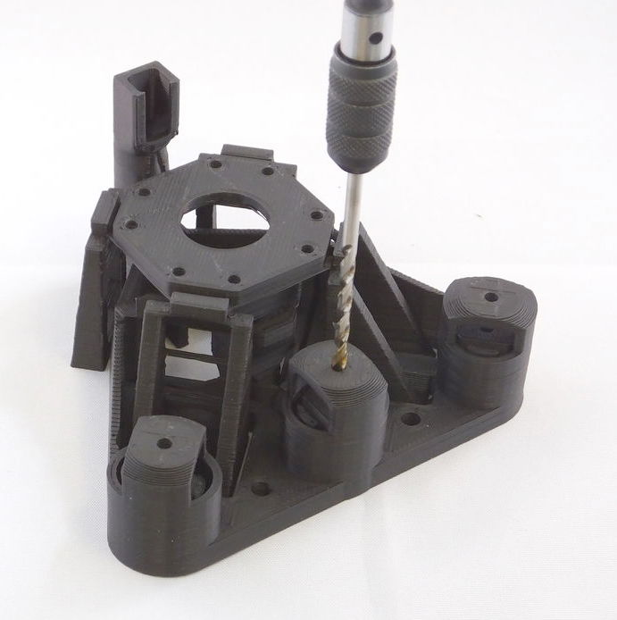

# Obtaining the parts
First, you will need to print or obtain the 3D printed parts.  If you bought a kit, skip this step! 

## Print settings
I usually print with a layer size of 0.24mm on my Ormerod, which takes 8 hours for the main structure.  "low" quality on an Ultimaker 2 (0.15mm layers) produced similar results in about 5 hours.  Our Prusa i3 Mk3 takes a similar time using 0.2mm layers, or 0.3mm layers if we want to go even faster.

> **Warning:** The microscope is designed to print without support material.  If you use support material it will require a lot of cleaning up, and you may well damage the parts.

The parts are all designed to print without support material or adhesion layer.  If you do use an adhesion layer, many of the moving parts will be rendered useless by a brim (particularly on the main body), and require lots of work with a craft knife to sort them out.  While there are no cantilevered parts that really need support, there are a few bridges; it might be a good idea to print the "just_leg_test.stl" file first, to make sure your printer can print them.  There are some versions of the main body that include a baked-in brim in the STL file, see [``main_body.scad``](../openscad/main_body.scad).  This brim does a better job of not fouling the mechanism than most slicers, and is a good option if the part won't stick without a brim.  Most of the other parts are possible to clean up after printing with a brim - 

If your printer has a standard-sized bed (180mmx180mm should be fine) then it should be possible to print the complete microscope in one go.  I do this if I'm using a machine that is well calibrated and reliable.  However, I find that it's often more reliable to print in batches (as small parts at the edge of the print bed can detach and cause it to fail).  I would recommend: 

*   Batch 1: Microscope, illumination and Optics module (main part)
*   Batch 2: Feet, gears, camera cover, camera board gripper, camera lens remover, gear riser

There is a test file that prints a single leg of the microscope - the Microscope leg test object. It's worth printing this first to check your settings are OK.

The optics module needs to print with some fine detail, so the dovetail meshes nicely with the stage.  A good way to ensure this is to print it at the same time as other parts - either print more than one optics module at a time, or print it at the same time as the microscope body.  This slows down the time for each layer, and means the plastic can cool more completely before the layer on top is deposited, resulting in a higher-quality part.  The optics module is best printed in black to cut down on stray light inside the tube - though it will still work in other colours.

## Standard builds of the microscope
The list of parts below is pretty extensive and tries to explain all the various options - however, if you just want to build a "normal" version of the microscope, there are two versions we'd reccommend:

### Webcam-based microscope
The basic version of the microscope uses a webcam lens instead of a microscope objective - you still get a really nice focusing/sample translation stage, but with basic options.  This version is great for school or hobby use, gets a resolution of about 2um or better, and is the cheapest to build.  This is the version we usually build at workshops.  For each microscope, you will need to print one copy of each of the following files:

* ``actuator_assembly_tools.stl``
* ``picamera_2_gripper.stl``
* [optional] ``picamera_2_lens_gripper.stl`` (only needed if your camera didn't come with a tool to remove the lens) 
* ``main_body_LS65.stl``.
* ``feet.stl``
* ``gears.stl``
* ``illumination_dovetail.stl``
* ``condenser.stl``
* ``sample_clips.stl``
* ``camera_platform_picamera_2_LS65.stl``
* ``lens_spacer_picamera_2_pilens_LS65.stl``
* ``microscope_stand.stl`` or ``back_foot.stl``

This will need the nuts, bolts, etc. described below, plus a Raspberry Pi computer (any model will do) and Raspberry Pi camera module.  No other optical bits are required, except an LED for illumination.  If your Raspberry Pi is in a case already, you should print ``back_foot.stl`` so the microscope sits flat on a table.  If you want to mount the Raspberry Pi underneath the microscope (our preferred option), print ``microscope_stand.stl`` instead.  Newer camera modules include a white circular tool for unscrewing the lens.  If you don't have one, you will need to print the lens gripper (marked as optional).

### High resolution microscope
The version of the microscope used for scientific or medical research generally requires a conventional objective lens.  Most of the parts are the same, but the optics and sample mount are different.  You will need one copy of each of the following files:

* ``actuator_assembly_tools.stl``
* ``lens_tool.stl``
* ``picamera_2_gripper.stl``
* [optional] ``picamera_2_lens_gripper.stl`` (only needed if your camera didn't come with a tool to remove the lens) 
* ``main_body_LS65-M.stl``.
* ``feet.stl``
* ``gears.stl``
* ``illumination_dovetail.stl``
* ``condenser.stl``
* ``sample_clips.stl``
* ``optics_picamera_2_rms_f50d13_LS65.stl``
* ``microscope_stand.stl``
* ``sample_riser_LS10.stl`` (assuming you have a microscope objective with a 45mm parfocal distance)

**For motorised operation you will also need**
* ``small_gears.stl``
* ``motor_driver_case.stl``

Additionally, you will need:
* an RMS threaded, finite-conjugates objective lens.  These can be obtained from e.g. AliExpress.  Depending on whether it is 35mm or 45mm from the "shoulder" of the lens to the sample, you may or may not need the sample riser.  We almost always use 45mm "plan" corrected lenses, which do require the riser.
* a 12.7mm diameter, 50mm focal length achromatic lens, e.g. ThorLabs ac127-050-a or generic equivalent.
* a 13mm diameter, 5mm focal length PMMA lens for the condenser (sold as LED lenses in bulk)
* three 28BYJ-48 stepper motors and a [sangaboard](https://github.com/rwb27/openflexure_nano_motor_controller/) driver, or other suitable electronics.

## Required parts
Make sure you have all the necessary parts and tools.  The parts should all be listed in the bill of materials, which is currently a work in progress (eventually it will be produced automatically, which should help it to stay accurate).  We reccommend reading through all the instructions, rather than trusting what is currently listed here. 

### Printed parts
Currently, the STL files live in the [builds folder](../builds).  This will move to a build server soon.

**Plastic tools:**
* band and nut insertion tools ``actuator_assembly_tools.stl``
* tool to insert the 13mm diameter condenser lens and/or tube lens: ``lens_tool.stl``
* jig to hold the camera board while you unscrew the lens ``picamera_2_gripper.stl``
* [optional] tool to unscrew the camera's lens (only needed if your camera didn't come with one) ``picamera_2_lens_gripper.stl``

**Components:**
* body of the microscope: ``main_body_<stage size><height>[-M].stl``.
* 3 feet: ``feet.stl`` or ``feet_tall.stl`` (contains all 3)
* 3 large gears: ``gears.stl`` (contains all 3)
* illumination:
 - ``illumination_dovetail.stl``
 - ``condenser.stl``
* 2 sample clips: ``sample_clips.stl`` (contains both)
* optics module (you need one of the two options below):
 - old-style optics module (one part, best with RMS objectives): ``optics_<camera>_<lens>_<stage size><height>.stl``
 - platform-style optics module (two parts, best with webcam lenses): ``camera_platform_<camera>_<stage size><height>.stl`` and ``lens_spacer_<camera>_<lens>_<stage_size><height>.stl``
* [optional] camera cover: ``picamera_2_cover.stl``
* [optional] 3 small gears for motors: ``small_gears.stl`` (contains all 3)
* [optional] riser for the sample: ``sample_riser_<stage size><thickness>.stl``
* [optional] slide holder that works better if using immersion oil: ``slide_riser_LS10.stl``
* [optional] base to hold a Raspberry Pi: ``microscope_stand.stl``
* [optional] base to hold the motor driver (fits under the base that holds the Pi): ``motor_driver_case.stl``
* [optional] back foot, in case you are not using the microscope stand: ``back_foot.stl``

In the filenames above, where there are multiple versions, parameters are included in angle brackets:
* ``<stage size>`` selects the size of the platform - but currently only ``LS`` is supported.
* ``<height>`` is the height from the bottom of the main body to the top of the stage in mm, currently either ``65`` or ``75``. 
* Usually the above two parameters occur next to each other, so you will see ``LS65``.  I pretty much only use ``65`` as standard, and if I am using an objective (which is the norm) I add a 10mm riser.
* ``<camera>`` is the camera you are using, either ``picamera_2`` for the Raspberry Pi camera module v2, ``c270`` for the Logitech C270, or ``m12`` for a camera with a screw-on M12 lens mount.
* ``<lens>`` is the lens you are using, either ``pilens``, ``c270_lens``, or ``m12_lens`` if you are using the lens that came with your camera.  To use a finite-conjugate, RMS threaded objective lens, you should specify ``rms_f50d13`` (for a 50mm focal length, 12.7mm diameter tube lens, e.g. ThorLabs ac127-050-a).  You can also specify ``rms_f40d16`` (to use a Comar tube lens, focal length 40mm, diameter 16mm) but this is deprecated as the images weren't as good. 
* ``<thickness>`` is the thickness of a stage riser - the amount it adds to the height.  Usually a 10mm riser is used with a 65mm body to allow a 45mm parfocal distance objective to be used, currently only LS10 is reccommended.
Optional bits of filenames are in square brackets above:
* ``-M`` in the body name means it has motor lugs to allow 28BYJ-48 stepper motors to be fitted
* ``_tall`` on the illumination or the feet means the body sits 26mm off the ground rather than 15mm, to give clearance for larger camera modules.  This is only useful if you are not using the microscope stand.

Currently, there are two reccommended versions of the body; ``LS65`` and ``LS65-M``.  The only difference is that the ``-M`` version can be fitted with motors.  To build the high-resolution version of the microscope, use the 10mm thick sample riser ``sample_riser_LS10.stl``, and ``optics_picamera_2_rms_f50d13_LS65.stl``.  To build the low-resolution version, don't use the sample riser, and instead use ``camera_platform_picamera_2_LS65.stl`` and ``lens_spacer_picamera_2_pilens_LS65.stl``.  In both cases, it's best to print the microscope stand, and use the standard-height feet.

### Non-printed parts
**Metal hardware:** 
*   3x M3 hexagon head 25mm screws, stainless steel
*   3x M3 brass nut
*   1x M3 steel nut (using brass is also fine)
*   8x M3 stainless steel washer
*   3-14x M3 8mm cap head screw (some ar optional, for sample clips and sample riser, but you will need at least three)
*   2-4x M2 6mm cap head screws
*   6x M4x6mm button head screws (optional, for motors)

**Electronic parts:** 
*   5mm White LED, resistor, wire, and 2-way JST header connector (so long as you have some way of lighting up the LED, it doesn't much matter)
*   Raspbery Pi camera module (v2, though v1 works too)
*   Raspberry Pi (with associated power supply, keyboard, monitor, etc.)
*   3x 28BYJ-48 micro stepper motors (optional)
*   Motor driver board for the above (optional)

**Optical parts:**
*   13mm diameter, 5mm focal length plastic condenser lens (optional, strongly recommended for high resolution optics)
*   12.7mm diameter, 50mm focal length achromatic lens (for high resolution optics only)
*   RMS threaded, finite-conjugates microscope objective (for high resolution optics only)

**Tools (not supplied in kit):** 
*   2.5mm hex key
*   1.5mm hex key (to secure the camera using M2 screws)
*   tape (electrical tape or PTFE plumbers tape work nicely, though regular sticky tape is also fine)
*   sharp craft knife (for trimming tape and cleaning up the print)
*   3mm drill bit in hand chuck (if you printed the parts yourself and need to open out the holes)
*   needle nose pliers (optional, but useful - particularly good for cleaning up prints)

Don't forget the raspberry pi, camera module, and associated screen, power supply, SD card, keyboard, mouse, etc. (I have not listed these explicitly, but they're needed to run the Pi). Also, if you use the high resolution optics module or want to add motors, you will need additional parts.

## Clean-up of printed parts
If you printed the parts yourself, start by opening out the three holes in the microscope body with a drill as shown.  Make sure to go all the way through.  If you don't have a drill, you can improvise by screwing in an M3 screw all the way, then forcibly rotating it with a screwdriver or the supplied nut.  Also, remove any loose strings of plastic from the underside of the sample stage, using a pair of pliers. The last step shouldn't be necessary if your machine is calibrated nicely for printing bridges.

There are also ties between the actuator column casing and the central actuator column that holds the brass nut - these need to be snapped, as described in the instructions later on.  There may also be short ties between the two thinner pairs of legs and the "wall" running around the microscope - these should also be snapped with a knife.  The "ladder" like structure between each pair of legs is also only there for support during printing - it does no harm to leave it in place, but if you cut the "rungs" out, it will allow the stage to move a little more freely.
