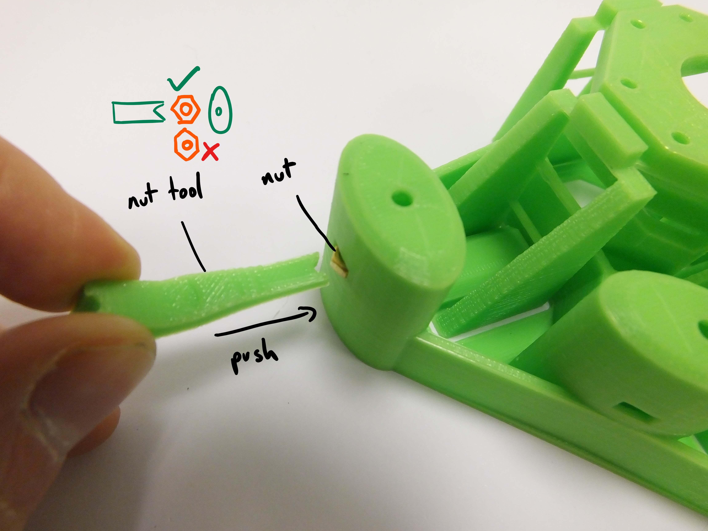
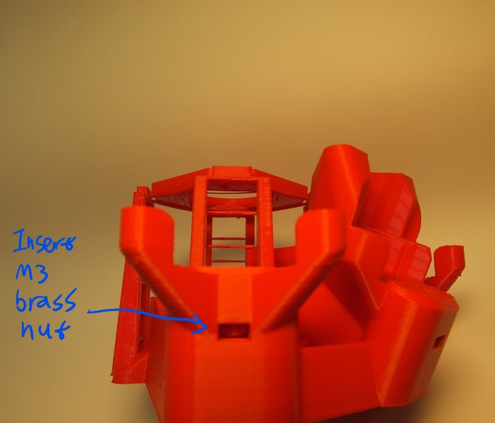
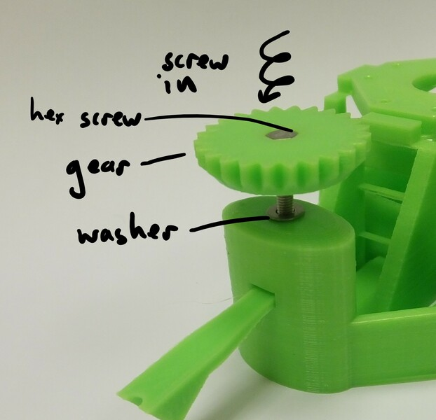
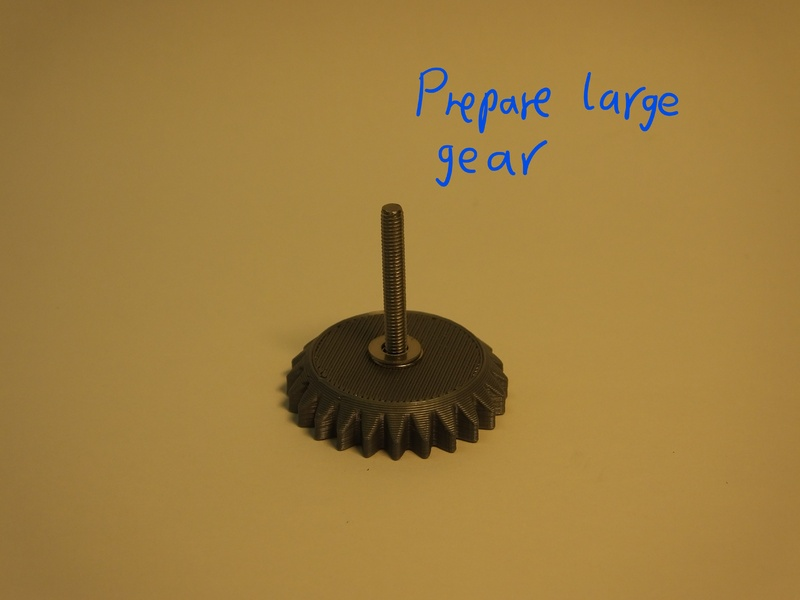
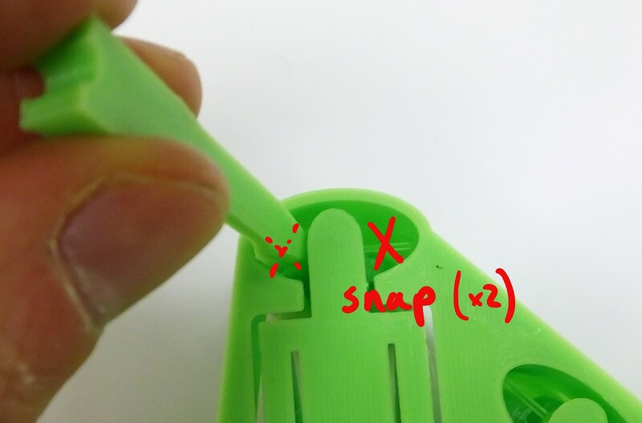
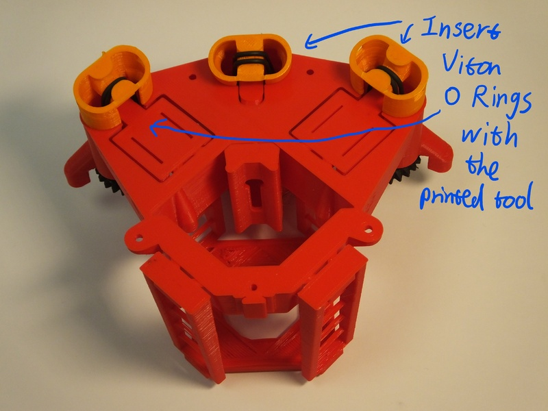
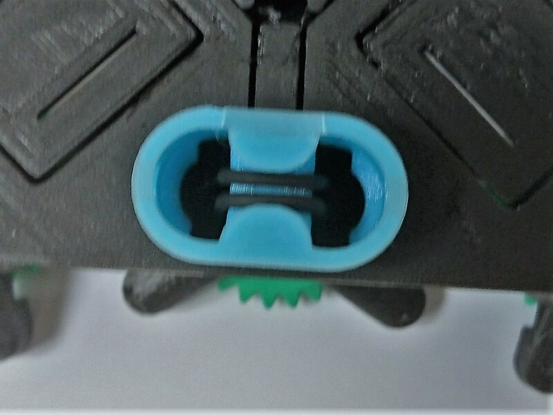

# Actuator assembly
There is one "actuator column" for each of the three axes of the OpenFlexure Microscope stage, to allow you to move the sample in X and Y, or focus the microscope by moving in Z.  It consists of a plastic gear that fits onto an M3 screw, which then pulls up on a brass nut.  Elastic bands pull down on the nut, tensioning the system.  The elastic band tightens up the mechanism, allowing us to move up and down smoothly.  Without the elastic band, you will only be able to move in one half of the microscope's range of travel, and the mechanism will be more wobbly.

# Requirements
All the parts you need for this step are in the picture below:

## Parts
*   3 [25mm hex head M3 screws](./parts/25mm_m3_hexagonhead_screw "consumes: 1")
*   3 [M3 brass nuts](./parts/m3_nut)
*   6 [M3 Washers](./parts/m3_washer)
*   3 [Viton O rings](./parts/viton_o_ring_30mm_inner_diameter_2mm_cross_section)
*   3 [Plastic gears](./parts/gearthumbscrew)
*   1 set of [Microscope Feet](./parts/microscope_feet) (NB there are different feet for X/Y axes and for the Z axis).
*   light grease (if available)

## Printed tools
*   [Nut insertion tool](./parts/nut_insertion_tool)
*   [O ring insertion tool](./parts/o_ring_insertion_tool)
*   [Craft knife](./parts/craft_knife)

# Assembly Instructions
There are three actuator columns on the microscope, for X, Y, and Z.  Follow these instructions for each column in turn.

## Step 1
We need to place a nut inside the actuator.  Insert it from the side, through the slot in the actuator column, and push it into place with the [nut insertion tool](./parts/nut_insertion_tool).  Take care to insert the nut corner-first (i.e. with flat sides parallel to the tool), otherwise it will jam.

## Step 2
Next, take a screw, and push it into a plastic gear, so that the head of the screw is embedded in the plastic.  Then, thread two washers onto the screw where it sticks out of the gear.  Put a very small blob of light oil or grease (if available) on the screw thread.  Put the screw into the hole at the top of the column, and screw it into the nut that is now inside the actuator.  The two washers should sit between the gear and the microscope body

## Step 3
Turn the microscope over and, using the elastic band tool or a craft knife, snap the two thin plastic supports as shown if they are present.

## Step 4
Hook one of the Viton bands over the elastic band tool, and pass the tool through the foot as shown.  You should end up with one loop of elastic band passing over each fork-shaped end of the insertion tool.  The flat side of the tool should be on the outside, so that the channels in either end face towards the centre of the foot.  Make sure you pick the right foot - the middle axis (Z) has a smaller foot.  The angle of the feet is different, if the foot doesn't line up with the outside of the microscope casing, you may be using the wrong one.

You may find it easier to put the band through the foot, then insert the tool and hook the band over either end - either way you should end up with the band, foot, and tool arranged as shown in the pictures.

## Step 5
Place the foot on the body, taking care that it's in the right place (the outer two actuators have sloping bottoms, but flat tops, the central Z axis has a sloping top and a flat bottom). You must also take care to put them on the right way round; the open part of the foot points towards the optics module in the centre of the microscope.

 
Push the insertion tool in until the band clicks into place.  Use the nut insertion tool to hold the actuator in place while you do this.  It might help to unscrew the gear a bit (so you can see some of the screw thread between the body and the gear) and push down on the gear.  When you push the band in, it should click twice - once for each side.  If you don't manage to hook both sides on, you may need to completely remove the band and try again - a wooden skewer, or small flat-bladed screwdriver works well to unhook the band without damaging it.
 
What's happening here is that the elastic band is pushed over little hooks inside the actuator column, near the top, and the click is the band popping into place.  The band pulls down on the actuator, so after it's in place the gear should turn with a little more resistance - this is important for the microscope to work properly.

## Step 6
You should now have the band pulling both sides of the actuator down as shown.

## Step 7
Congratulations, you've assembled the actuator!  There are three to do, so you may now need to go back and make the next one.
