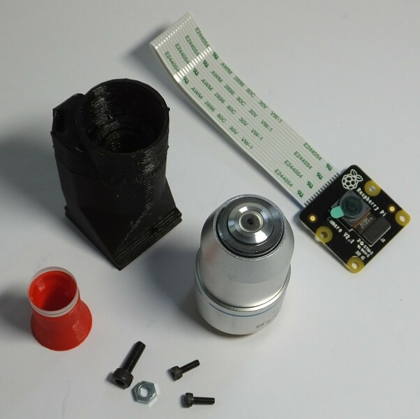
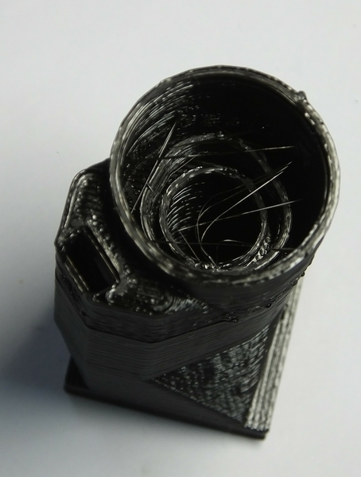
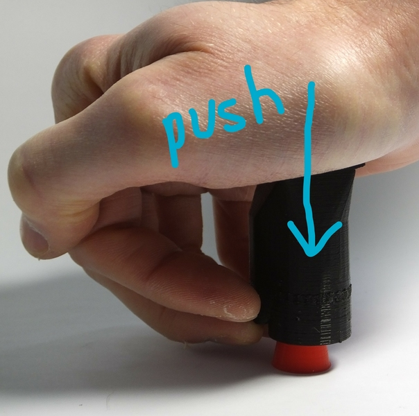
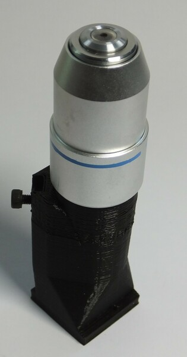
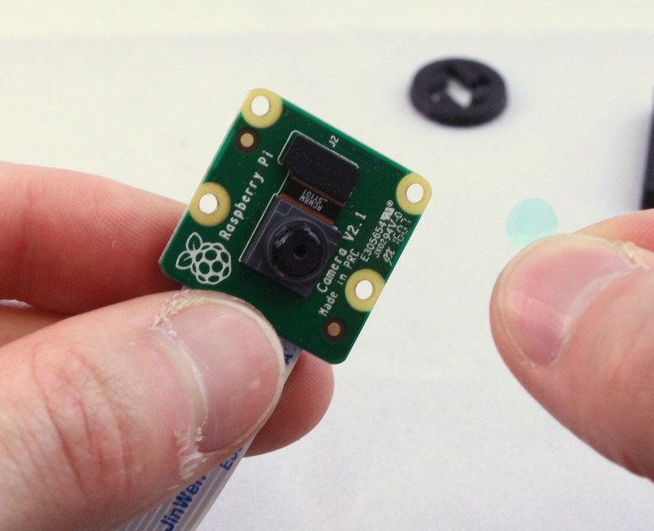
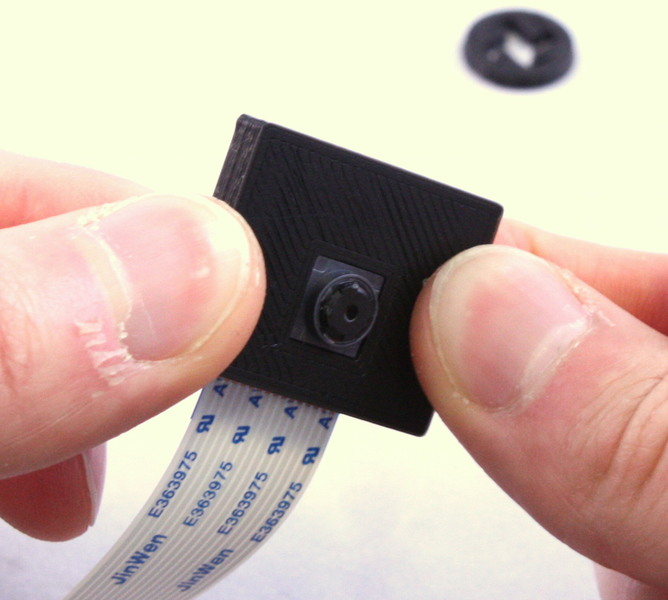

# High resolution optics module
To get lab quality images from your microscope, you need to use more sophisticated optics than a webcam lens.  This optics module uses an RMS threaded microscope objective, with a tube length correction lens, to take very high quality images.

# Requirements
You will need the parts shown in the picture below:

## Parts
*   1 [RMS optics module casing](./parts/hires_optics_casing)
*   1 Raspberry Pi camera module (ideally v2, though v1 should also work)
*   1 [M3 steel nut](./parts/m3_nut)
*   1 [M3x10mm cap head screw](./parts/m3x10mm_cap_head)
*   2 [M2x6mm cap head screws](./parts/m2x6mm_cap_head)
*   1 [12.7mm diameter, 50mm focal length achromatic lens](./parts/d13_f50_achromat)
*   1 RMS threaded microscope objective

## Tools
*   1 [Tube lens insertion tool](./parts/tube_lens_insertion_tool)
*   1 2.5mm hex key
*   1 1.5mm hex key
*   1 scalpel or craft knife (optional)
*   1 [Tool for removing the lens](./parts/camera_lens_removal_tools)

# Assembly Instructions
## Step 1
First, get the necessary tools and parts: the optics module plastic part, the Raspberry Pi camera module, the tools for removing the camera lens, two M2 screws to secure the camera, the tube lens, and the objective.  Depending on print quality, you might also need a sharp craft knife.
 
NB the lens removal tools, board gripper, and optics module are all specific to the camera you're using.  This version of the instructions is for version 2 of the camera board, version 1 of the Rasbperry Pi camera module will also work, but you will need to remove the lens with pliers or tweezers instead.  Version 2 of the camera module ships with a lens removal tool included, which is a white disc of plastic with a hole in the centre.  This is better than the printed lens removal tool, if it's available.

## Step 2
Before assembling the parts into the holder, make sure it's free from dust by blowing some air through it, and check there are no strings of plastic in the central hole through the mount - an example with strings of plastic is shown in the picture.  Use a craft knife to remove these strings, and blow out any debris that remains inside the optics module.

## Step 3
Slide the M3 nut into the plastic holder, and screw the M3 screw into it as shown.  This will mount the optics module into the microscope.

## Step 4
Next, put the lens into the push-fit holder.  Start by placing the tube lens insertion tool on a table, with the larger end down.  Then, put the lens on the tool (shown in red below), with the more convex side facing down.  Next, carefully line up the optics module casing with the lens, and push it down on top of the lens.  This might take a little force, I use the heel of my hand.  The glass lens is harder than the plastic so is unlikely to crack, but try to avoid too much sideways motion, as this can scratch the surface of the lens.

## Step 5
Screw the objective into the plastic casing.  The printed thread is not hugely strong, and may not have printed very precisely - the means it might be a little loose or a little tight, and you need to be very careful to screw the objective in straight in order to avoid cross-threading.

## Step 6
We need to remove the lens from the camera.  To do this, you need the two plastic tools (the board gripper and the lens remover) as well as the camera module.  It's best to make sure you have completed the steps up to this point before removing the lens, to minimise the amount of time the sensor is exposed to air and dust.

> **WARNING!** The camera board is static sensitive.  Take the usual anti-static precautions (ideally use an anti-static wristband connected to ground, but at the very least make sure you touch an earthed object, such as a metal pipe, before working on the camera module.

## Step 7
Remove the protective film from the camera lens.

## Step 8
There is a small ribbon cable connecting the camera to the PCB that is very easy to break.  There is a square plastic jig that fits over the camera and PCB (the "camera board gripper"), which stops the camera twisting and damaging the ribbon cable.  Fit this over the camera as shown.  Note that the part for v2 of the camera board will sort-of fit v1, but you need to be a little more careful as it's not a perfect fit.

## Step 9
Next, unscrew the lens from the camera module.  Use the plastic tool to grip the lens module.  This is a small circular part with four prongs that fits over the lens of the camera board (version 2 only) as shown.  To remove the lens, push the removal tool onto the lens (just the top part, with the little plastic flanges) and turn anticlockwise to remove it.
 
The printed tool only works if the prongs are pointing anticlockwise, so make sure it's the right way round.  The plastic tool supplied with the camera module is better, and only fits one way up.  It's important to use the board gripper to hold the camera chip in place and prevent damage to the delicate ribbon cable.  After you've removed the lens, check that the little black (or orange) ribbon cable connecting the camera module to the PCB is still connected - pop it back in by pushing it with a finger if needed.

Once you've removed the lens, be sure to place the camera face down on the desk, or put a piece of tape over the square black lens holder; this will help stop dust settling on the sensor, which is extremely hard to clean.

## Step 10
Fit the camera module on to the bottom of the plastic housing, and secure it in place with the two M2 screws.

## Step 11
Well done - you have assembled the optics module.

