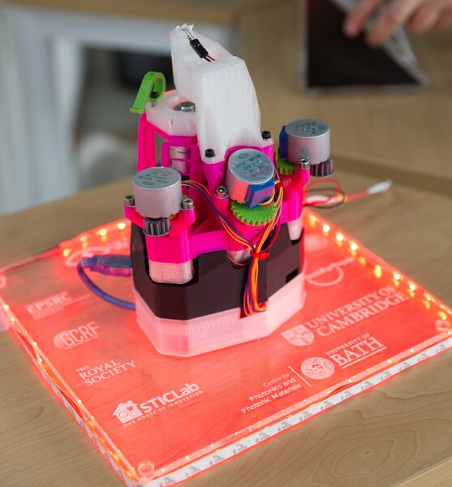

# The OpenFlexure Microscope: Assembly Instructions
The OpenFlexure Microscope is a 3D printable microscope, with a very precise mechanical translation stage.  It can be fitted with basic webcam-based optics, or more expensive optics based on a traditional microscope objective for higher image quality.  It can also be motorised.  These instructions will take you through how to assemble the microscope optical and mechanical parts.

## Printing the parts
Before we start, a note on printing - there are many possible versions of the microscope, so don't just print everything in the folder of STL files.  Currently, there's a readme document in the ``builds`` folder explaining how to select your versions.  Please do consult it before printing.  Also note that the parts are designed to print without support material on most RepRap type printers.  If you use support material, the parts will be difficult to clean up, and may well be damaged in the process - particularly the delicate main body.

## Contents
Assembly is broken up into several steps:
* [Printing parts](./0_printing.md)
* [Assembling the actuators](./1_actuator_assembly.md) deals with the mechanism for moving the stage.
* The optics module comes next, either the [basic optics module](./2a_basic_optics_module.md) or the [high resolution optics module](./2b_high_resolution_optics_module.md).
* [Illumination](./3_illumination.md) covers attaching the condenser.
* [Sample clips and wiring](./4_clips_and_wiring.md) completes the microscope.
* [Motors](./5_motors.md) can be added for automatic control.

Happy building!

## About the microscope
The OpenFlexure microscope is a customisable optical microscope, using either very cheap webcam optics or lab quality, RMS threaded microscope objectives.  It uses an inverted geometry, and has a high quality mechanical stage which can be motorised using low cost geared stepper motors.

The original paper describing this work is available open-access from [Review of Scientific Instruments](http://dx.doi.org/10.1063/1.4941068) and you can read various [media articles](https://github.com/rwb27/openflexure_microscope/wiki/Media-Articles) about it for a more user-friendly introduction.

Optomechanics is a crucial part of any microscope; when working at high magnification, it is absolutely crucial to keep the sample steady and to be able to bring it into focus precisely.  Accurate motion control is extremely difficult using printed mechanical parts, as good linear motion typically requires tight tolerances and a smooth surface finish.  This design for a 3D printed microscope stage uses plastic flexures, meaning its motion is free from friction and vibration.  It achieves steps well below 100nm when driven with miniature stepper motors, and is stable to within a few microns over several days.

This design aims to minimise both the amount of post-print assembly required, and the number of non-printed parts required - partly to make it as easy as possible to print, and partly to maximise stability; most of the microscope (including all the parts with flexures) prints as a single piece.  The majority of the expense is in the Raspberry Pi and its camera module; the design requires only around 200g of plastic and a few nuts, bolts and other parts.  The optics module (containing the camera and lens) can be easily swapped out or modified, for example to change the magnification/resolution by using a microscope objective, or adding a filter cube for fluorescence.

## Acknowledgements
This design has largely come out of academic research projects, and we would like to acknowledge financial support from:
* The [Engineering and Physical Sciences Research Council](http://epsrc.ukri.org/) (grants EP/P029426/1, EP/R013969/1)
* The Royal Society
* The Royal Commission for the Exhibition of 1851
* Queens' College, Cambridge

The lead developer started this project while at the University of Cambridge, and continues to work on it at the University of Bath, UK.

## Contributors
* Richard Bowman <r.w.bowman@bath.ac.uk> (University of Bath)
* Julian Stirling (University of Bath)
* Grace Anyelwisye Mwakajinga (STICLab)
* Valerian Sanga (STICLab)
* Qixing Meng (University of Bath)

This design is (c) the contributors, released under the CERN open hardware license.