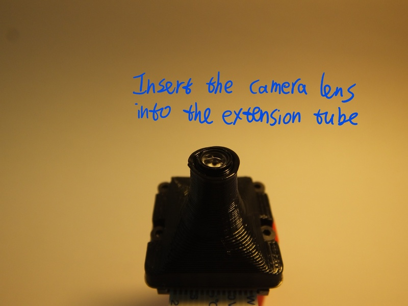
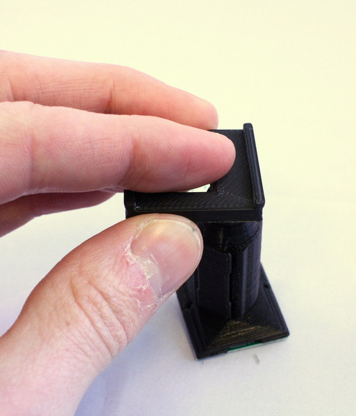
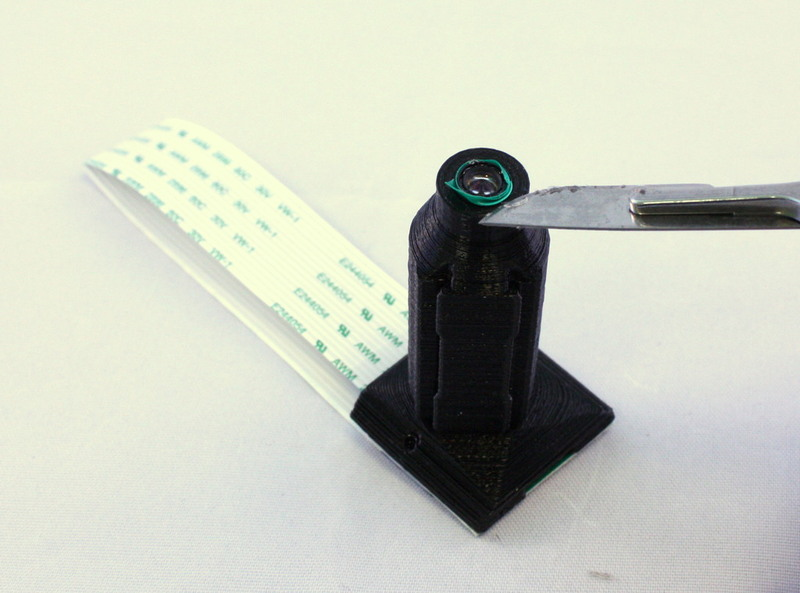
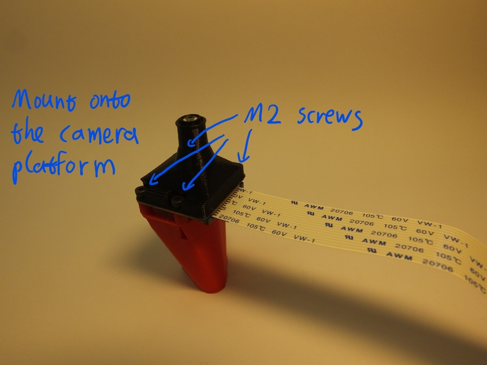

# Basic optics module
The simplest option for the microscope optics is to use a webcam lens.  This is an old photographers' trick, where a wide angle lens is turned backwards and used as a macro lens, so the side that would have pointed at the camera sensor now points at the sample.  Because webcams have very small pixels, using a webcam in reverse makes quite a good microscope objective.  This version of the optics module turns the Raspberry Pi camera into a microscope with a field of view about 400um across and a resolution of around 2um.

# Requirements
You will need the parts shown in the picture below:

## Parts
*   1 [Camera platform](./parts/camera_platform)
*   1 [Lens extension tube](./parts/lens_spacer)
*   1 Raspberry Pi camera module (ideally v2, though v1 should also work)
*   1 [M3 steel nut](./parts/m3_nut)
*   1 [M3x10mm cap head screw](./parts/m3x10mm_cap_head)
*   4 [M2x6mm cap head screws](./parts/m2x6mm_cap_head)

## Tools
*   1 2.5mm hex key
*   1 1.5mm hex key
*   1 scalpel or craft knife (optional)
*   1 [Tool for removing the lens](./parts/camera_lens_removal_tools)

# Assembly Instructions
## Step 1
First, get the necessary tools and parts: the optics module plastic parts (the lens spacer and the camera platform), the Raspberry Pi camera module, the tools for removing the camera lens, two M2 screws to secure the camera.  Depending on print quality, you might also need a sharp craft knife or some tape.
 
NB the lens removal tools, board gripper, and optics module are all specific to the camera you're using.  This version of the instructions is for version 2 of the camera board, version 1 of the Rasbperry Pi camera module will also work, but you will need to remove the lens with pliers or tweezers instead.  Version 2 of the camera module ships with a lens removal tool included, which is a white disc of plastic with a hole in the centre.  This is better than the printed lens removal tool, if it's available.

## Step 2
We need to remove the lens from the camera.  To do this, you need the two plastic tools (the board gripper and the lens remover) as well as the camera module.  It's best to make sure you have completed the steps up to this point before removing the lens, to minimise the amount of time the sensor is exposed to air and dust.

> **WARNING!** The camera board is static sensitive.  Take the usual anti-static precautions (ideally use an anti-static wristband connected to ground, but at the very least make sure you touch an earthed object, such as a metal pipe, before working on the camera module.

## Step 3
Remove the protective film from the camera lens.

## Step 4
There is a small ribbon cable connecting the camera to the PCB that is very easy to break.  There is a square plastic jig that fits over the camera and PCB (the "camera board gripper"), which stops the camera twisting and damaging the ribbon cable.  Fit this over the camera as shown.  Note that the part for v2 of the camera board will sort-of fit v1, but you need to be a little more careful as it's not a perfect fit.

## Step 5
Next, unscrew the lens from the camera module.  Use the plastic tool to grip the lens module.  This is a small circular part with four prongs that fits over the lens of the camera board (version 2 only) as shown.  To remove the lens, push the removal tool onto the lens (just the top part, with the little plastic flanges) and turn anticlockwise to remove it.
 
The printed tool only works if the prongs are pointing anticlockwise, so make sure it's the right way round.  It's important to use the board gripper to hold the camera chip in place and prevent damage to the delicate ribbon cable.  After you've removed the lens, check that the little black or orange ribbon cable connecting the camera module (the black square of plastic from which you unscrewed the lens) to the PCB is still connected - pop it back in by pushing it with a finger if needed.

Once you've removed the lens, be sure to place the camera face down on the desk, or put a piece of tape over the square black lens holder; this will help stop dust settling on the sensor, which is extremely hard to clean.

## Step 6
Before assembling the parts into the holder, make sure it's free from dust by blowing some air through it, and check there are no strings of plastic in the central hole through the mount.

## Step 7
Next, put the lens into the plastic extension tube.  This should just push-fit, but may take a small amount of force, or  require a layer of tape wrapped around the lens to make it fit tightly (depending on your printer).  If you wrap tape around the lens, trim off any tape that protrudes above the lens with a scalpel or sharp craft knife.  NB the lens should go in with the side that was next to the camera sensor on top, and the side that was facing outwards (the one with a small hole in the black plastic) facing into the extension tube.

## Step 8
Fit the extension tube onto the camera board, then put the camera board and extension tube onto the camera platform.  Secure it in place with two M2 screws, which go through the extension tube and the camera board, and into the platform.  You can use two more M2 screws if available to make the joint stronger.

## Step 9
Slide a nut into the nut trap on the side of the camera platform.  This probably doesn't need a tool, but you could use a 2.5mm hex key to push it in.

## Step 10
Screw the M3 screw into the nut, so that it sticks out the side of the camera platform.

## Step 11
Well done - you have assembled the optics module.

