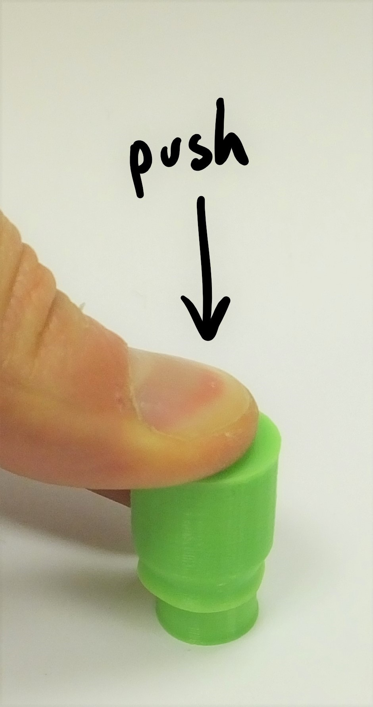

# Assemble the illumination
The microscope usually works by looking at light that has passed through the sample - so we need to illuminate the sample from above.  This section takes you through the assembly of the illumination arm.

# Requirements
## Parts
*   1 [Illumination dovetail](./parts/illumination_dovetail)
*   1 [condenser arm](./parts/condenser)
*   1 [5mm LED](./parts/white_led) ideally wired up to a 2-way female header
*   2 [M3x8 cap head screws](./parts/m3x8mm_screws)
*   2 [M3 Washers](./parts/m3_washer)
*   1 [Condenser lens](./parts/condenser_lens) (optional)

## Tools
* 2.5mm hex key
* Condenser lens insertion tool (if using a condenser lens)

# Assembly Instructions
## Step 1
To build the condenser, you will need the two parts of the mounting arm, two M3 screws and washers, the LED & cable.  If you are using a condenser lens, you will also need the printed lens insertion tool to put the lens into the holder.

## Step 2
*This is an optional step.  If you are not using the condenser lens, skip to step 3*

Place the condenser lens on the insertion tool (flat side down), and push the condenser housing down onto it.  Take care to keep it vertical.  You may need to push fairly hard.  As with the tube lens in the optics module, check it's flat and push again if necessary.

## Step 3
Insert the LED into the condenser housing.  It should push-fit and stay in place.  It can be glued or taped if it doesn't stay in.

## Step 4
Assemble the cable for the LED, if you don't have one soldered on already.  You just need to be able to light it up - we usually do this by soldering the LED to a resistor (about 80 ohms), then attaching about 20cm of cable with female crimps on the end.  This can easily be plugged onto the Raspberry Pi's 5v GPIO pin.

## Step 5
Place the illumination dovetail onto the platform on the microscope body, and secure in place with the two M3 screws.  Use a washer between the screw and the dovetail.  The holes on the microscope should be just the right size for the M3 screw, but you might need to use some force to get the screws in.  Be careful to stop turning the screws as soon as the dovetail is mounted tightly, though - otherwise you might damage the threads.

## Step 6
Clip the horizontal part of the condenser onto the vertical dovetail.

## Step 7
Neatly thread the cable for the LED through the gap between the condenser and the dovetail, and then down beside the optics module to the bottom of the microscope.  Don't pass it through the hole in the centre of the flat stage - pass it between the stage and the dovetail.

## Step 8
You have assembled the illumination - nearly there!

