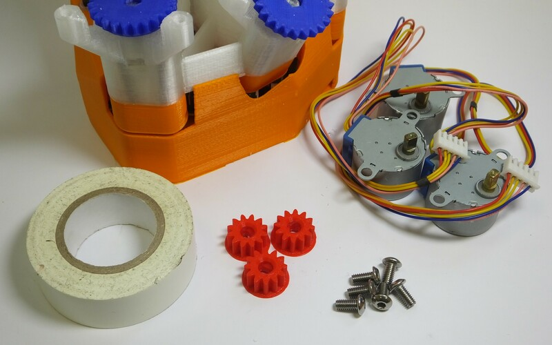
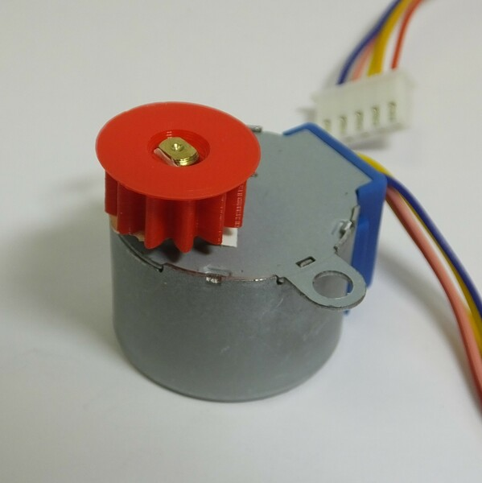
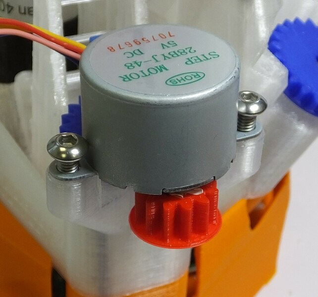
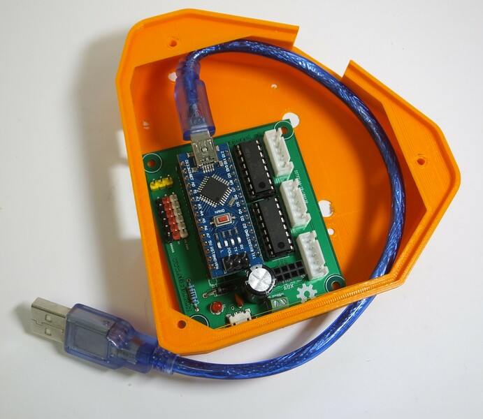
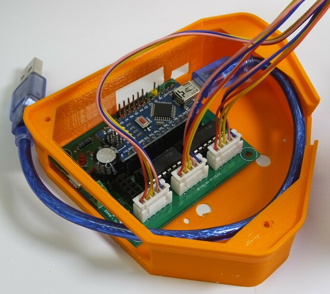

# Motor assembly
The OpenFlexure Microscope can be motorised, to allow you to run automated experiments.  In order to do this, you will need to fit stepper motors to the X, Y, and Z axes.

# Requirements
You will need the parts shown in the picture below:

## Parts
*   1 Microscope, with actuators already assembled
*   3 Small printed gears
*   3 28BYJ-48 micro geared stepper motors
*   6 M4x6mm button head screws
*   1 Motor board case
*   1 Motor driver board
*   1 Short mini USB lead
*   2 Small cable ties

## Tools
*   1 2.5mm hex key
*   3cm insulating tape

# Assembly Instructions
## Step 1
First, fit the gears onto the motors.  The gears are printed with a circular bottom - place them on the table, circular side down.  They should be a tight fit onto the motor shaft - if they are not, place some insulating tape, sticky side up, on top of the gear as shown.

## Step 2
Now, fit the gear (and tape) onto the motor shaft - with the gear on the table, press the shaft into the hole.  NB you need to line the flat sides of the shaft up with the hole - it is not circular.

## Step 3
Repeat steps 1 and 2 for all three motors.

## Step 4
Fit each of the three motors onto the microscope body using two M4 screws.  It is possible that this step will be easier if you tap the holes in the microscope body first.  The screws should be done up tightly, otherwise the motor will wobble.

## Step 5
Fit the mini USB lead to the motor board, and fit the motor board into the case as shown.

## Step 6
Connect the cables from the motors to the motor board as shown.

## Step 7
Finally, sit the microscope on top of the motor board case, and tidy up the wiring using the cable ties.  You can more securely attach the motor board to the microscope using M3 screws at the corners, but you might want to wait until you have tested it in case you need to swap the wiring around.

## Step 8
Congratulations, you have fitted the motors.  You will need to upload the motor controller firmware using the Arduino IDE.  Currently, the [firmware resides on github](https://github.com/rwb27/openflexure_nano_motor_controller).
