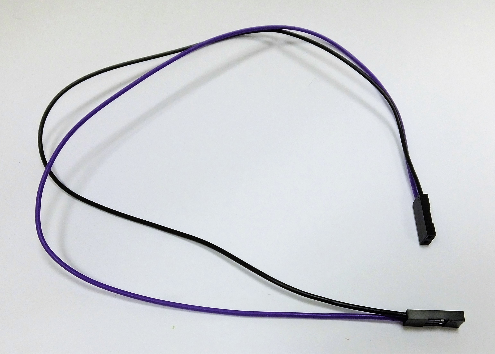
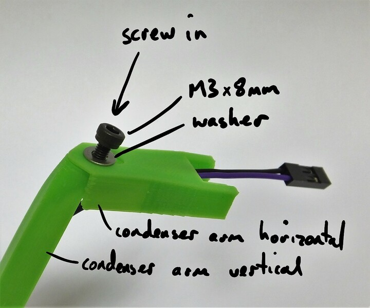
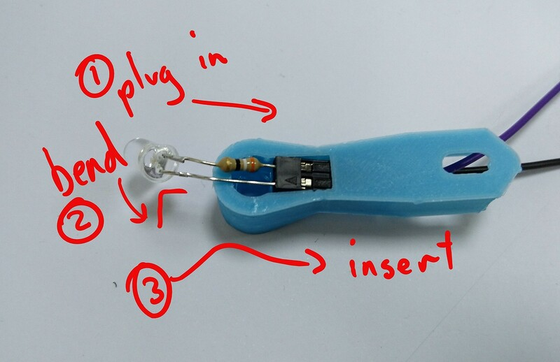
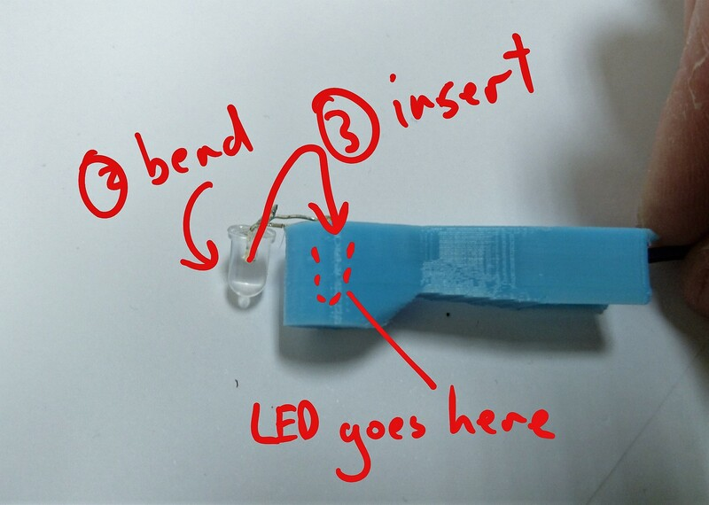
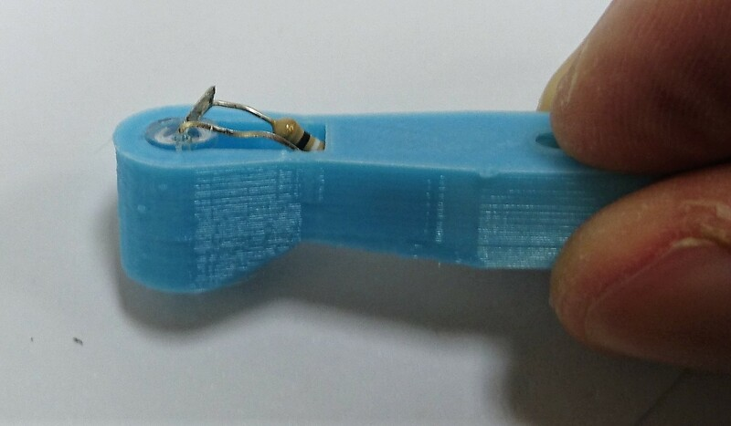

# Adjustable Illumination Arm
A holder for an LED to take images in transmitted light.

The illumination arm holds an LED above the sample.  There is a screw holding the two parts together, which goes through a slot to allow simple, slip plate style alignment of the LED.  You can use some white tape stuck over the LED as a diffuser to improve the microscope's resolution - though you may want to consider using the [condenser lens version](./illumination_arm_with_condenser) if you have an RMS microscope objective.

# Requirements
## Parts
*   1 of [Plastic mounting parts](./parts/illumination_arm_and_rear_foot)
*   1 of [Wiring](./parts/jumper_wires_with_female_header_pin_connectors)
*   1 of [LED](./parts/white_led)
*   1 of [Attachment screw](./parts/m3x8mm_screws)
*   1 of [Washer for illumination arm](./parts/m3_washer)
*   1 of [Nut for illumination](./parts/m3_nut)

# Assembly Instructions
## Step
To build the condenser, you will need the two parts of the mounting arm, an M3 screw and washer, the cable, and the LED (ignore the condenser lens shown in the picture).
### Media
*   

## Step
Assemble the cable for the LED.  If using pre-crimped cables, as supplied with our kit, fit the 2-way header to either end.  Don't worry about polarity, it's easy and harmless to simply rotate the connector 180 degrees if you need to.
### Media
*   
*   

## Step
Thread the cable through the larger, vertical part of the mounting arm as shown.  The smaller part is different from the one shown in the picture, but the cable should still fit through.
### Media
*   

## Step
Screw the horizontal part of the mounting arm onto the vertical part.  You should be able to put a nut into the top of the vertical part.
### Media
*   

## Step
Connect the LED to the cable by pushing the legs into the 2-way housing.  Bend the lens part of the LED at right angles to the legs, lift it up, and insert it into the hole.
### Media
*   
*   
*   

## Step

Slot the illumination arm on to the dovetail mount for it at the back of the microscope. It should be pushed on from the bottom, and there is a stop to prevent it sliding up and off.

 
The thin linker between the two sides of the clip may snap - this is not a problem, it's there only for support during printing.  Wiggling the illumination arm from side to side makes it easier to push on.  It might help to grip the middle actuator and the edge of the base as you do this, as it sometimes requires a little force.

 
You can hold it in place more strongly with an additional M3 screw and washer, through the lip that sits underneath the microscope body.

 
### Media
*   

# Notes
A holder for an LED to take images in transmitted light.

