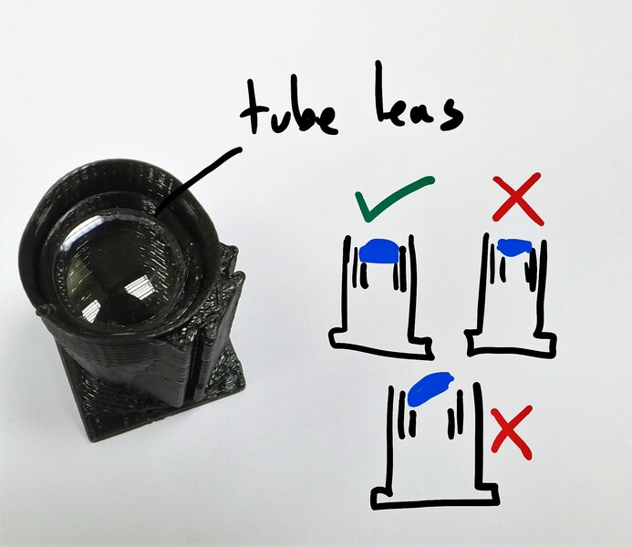
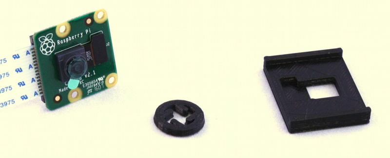
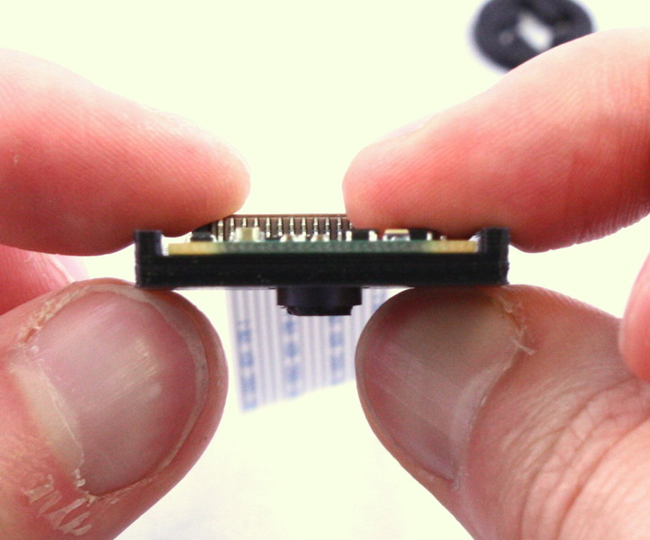
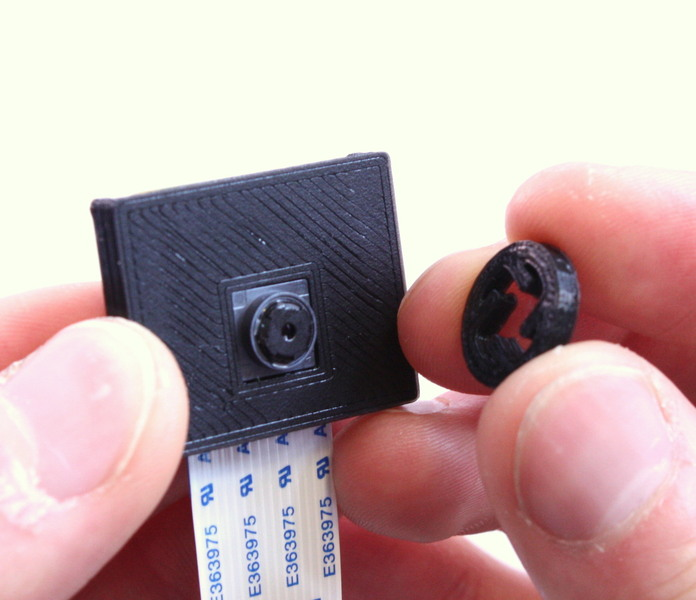
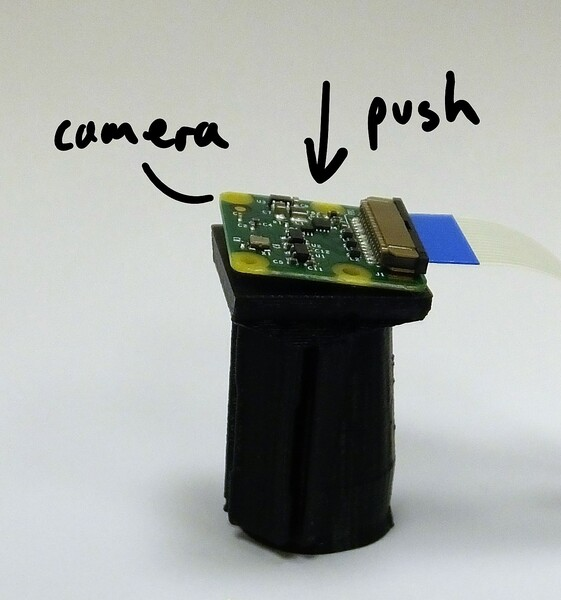
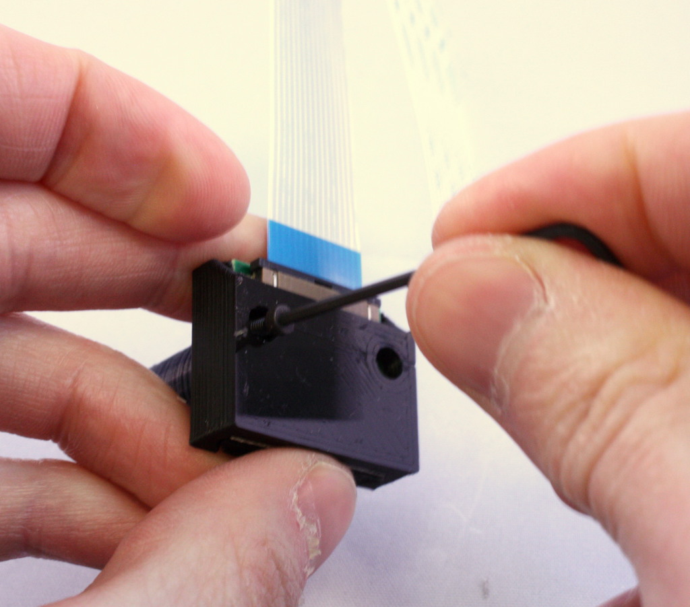
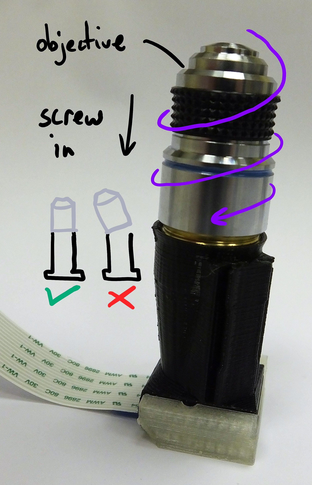

# High-resolution Optics Module
This is a simple tube microscope, using an RMS objective lens and a second lens for tube length correction.  It allows the OpenFlexure microscope to take images with higher resolution than those obtained with the webcam lens.

This is the optics module for the OpenFlexure Microscope.  It holds a Raspberry Pi camera module and an objective lens.  It's compatible with the LS65 or LS75 version of the stage, depending on whether the objective has a 25mm or 35mm parfocal distance.

# Requirements
## Parts
*   1 of [Mechanical holder](./parts/optics_module_plastic_parts)
*   1 of Optics and Sensor
*   1 of [Tools for removing the lens](./parts/camera_lens_removal_tools)

# Assembly Instructions
## Step

First, assemble the necessary tools and parts: the optics module plastic part (and camera board cover if you're using a Pi camera), the camera module, the tools for removing the camera lens, the tool for inserting the tube lens, and two M2 screws to secure the camera (if using Pi camera).

 
NB the lens removal tool, board gripper, and optics module are all specific to the camera you're using.  This version of the instructions is for version 2 of the camera board, if you have v1 it's a similar process but the older versions of the instructions give more detail.  You'll also need to use older STL files, support for v1 of the camera module was removed in v5.17.

 
Later production runs of the Raspberry Pi camera module ship with a lens removal tool included, which is better than the printed tool.  This is a white disc of plastic with a hole in the centre.

 
### Media
*   

## Step
WARNING! The camera board is static sensitive.  Take the usual anti-static precautions (ideally use an anti-static wristband connected to ground, but at the very least make sure you touch an earthed object, such as a metal pipe, before working on the camera module.
### Media
*   

## Step
Before assembling the parts into the holder, make sure it's free from dust by blowing some air through it, and check there are no strings of plastic in the central hole through the mount.

## Step
First, insert the tube lens into the holder.  Place the lens on the insertion tool, curved side down.  Take the optics module, and line it up with the lens.  Push down, and the lens should pop into place.  Take care to keep the optics module straight as you do this.
### Media
*   

## Step
If the lens does not sit flat, place the optics module on the insertion tool and push again - it may require some force, and you should hear it click into place.
### Media
*   

## Step
We need to remove the lens from the camera.  To do this, you need the two plastic tools (the board gripper and the lens remover) as well as the camera module.  If you are using a USB camera, the lens is held on by two screws from the back, and can be removed by unscrewing these. **Save the screws**, as you will need them later!
### Media
*   

## Step
Remove the protective film from the camera lens.
### Media
*   

## Step
There is a small ribbon cable connecting the camera to the PCB that is very easy to break.  There is a square plastic jig that fits over the camera and PCB (the "camera board gripper"), which stops the camera twisting and damaging the ribbon cable.  Fit this over the camera as shown.  Note that the part for v2 of the camera board will sort-of fit v1, but you need to be a little more careful as it's not a perfect fit.  For USB webcams, the lens can simply be unscrewed from the back of the PCB with a small screwdriver.
### Media
*   
*   

## Step

Next, unscrew the lens from the camera module.  Use the plastic tool to grip the lens module.  This is a small circular part with four prongs that fits over the lens of the camera board (version 2 only) as shown.  To remove the lens, push the removal tool onto the lens (just the top part, with the little plastic flanges) and turn anticlockwise to remove it.

 
The tool only works if the prongs are pointing anticlockwise, so make sure it's the right way round.  You may feel a crack as it starts to move - this is normal.  It's important to use the board gripper to hold the camera chip in place and prevent damage to the delicate ribbon cable.  After you've removed the lens, check that the little black ribbon cable connecting the camera module (the black square of plastic from which you unscrewed the lens) to the PCB is still connected - pop it back in by pushing it with a finger if needed.

 
Once you've removed the lens, be sure to place the camera face down on the desk, or put a piece of tape over the square black lens holder; this will help stop dust settling on the sensor, which is hard to clean.

 
If you are using a USB camera, the lens is held on by two screws from the back, and can be removed by unscrewing these. **Save the screws**, as you will need them later!

 
### Media
*   
*   
*   

## Step
Finally, press the camera module onto the bottom of the optics mount.  It should not be a tight fit, but the cover and two M2 screws will hold it in place in the next step.  If you're using the USB version, the board simply screws onto the optics module using the screws that held the lens on.
### Media
*   

## Step
Place the cover on top of the camera board, then screw the cover and the camera board onto the optics module, using two M2 screws.
### Media
*   

## Step
Finally, screw the objective into the tapered opening at the top of the module.  Take care to keep it aligned with the axis of the module - when it is screwed down, you don't want a gap anywhere between the top of the plastic and the bottom of the objective "shoulder".  This may be a tight fit - sometimes clamping the optics module in a vice is helpful.
### Media
*   

# Notes
This is a simple tube microscope, using an RMS objective lens and a second lens for tube length correction.  It allows the OpenFlexure microscope to take images with higher resolution than those obtained with the webcam lens.

