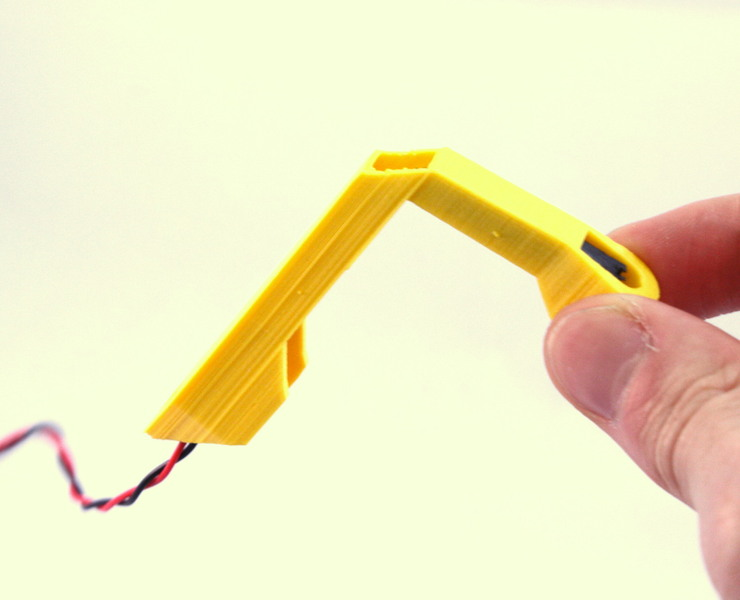
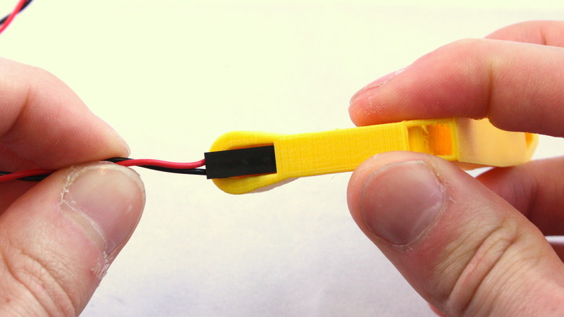
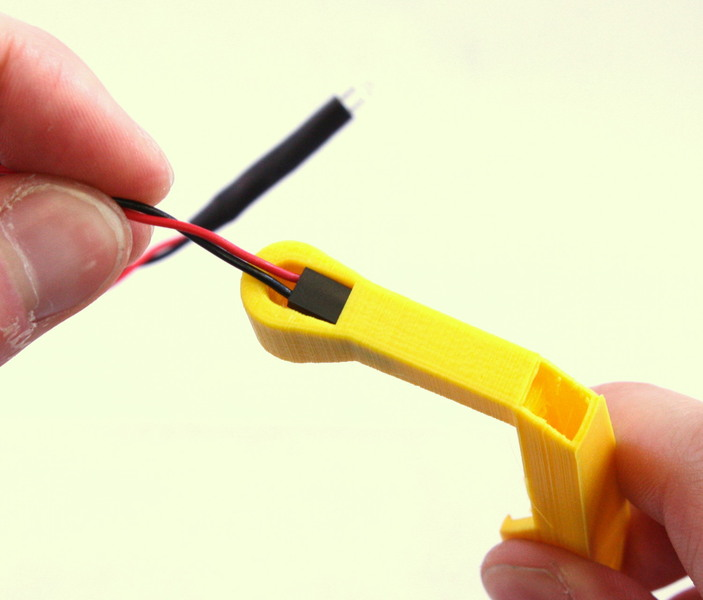
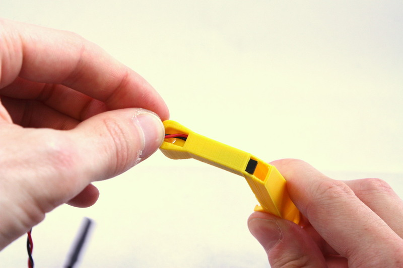
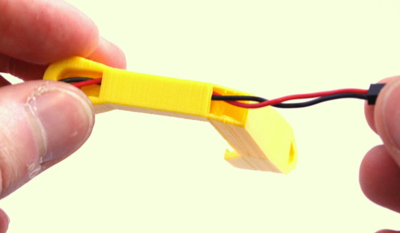
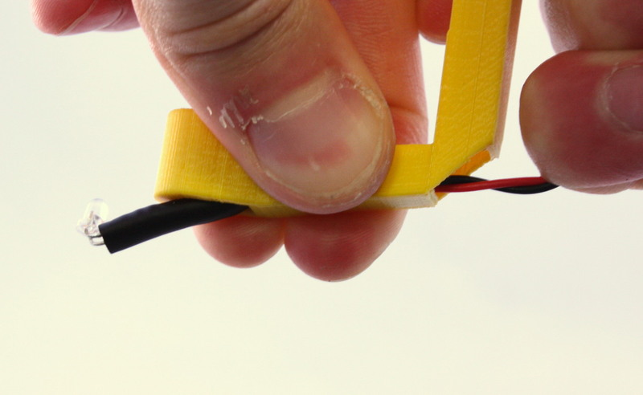
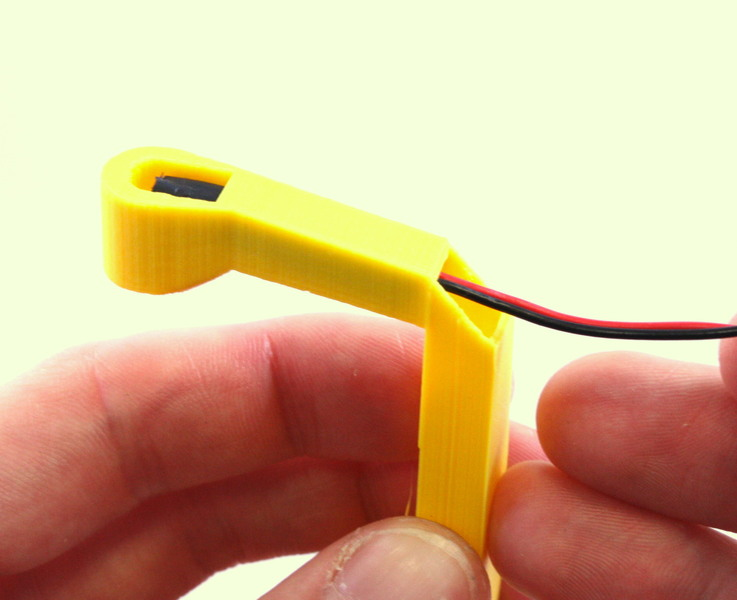
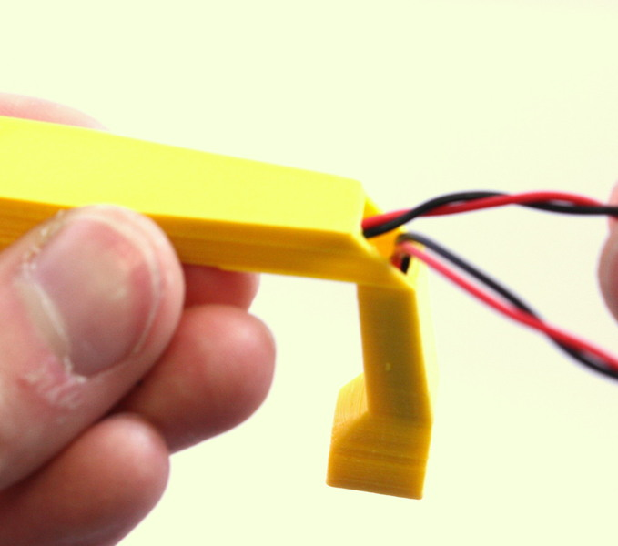
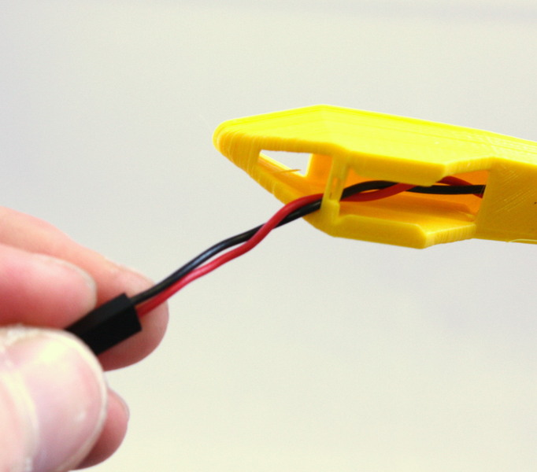

# Illumination Arm (fixed)
A holder for an LED to take images in transmitted light.

The illumination arm holds an LED above the sample, for simple transmission images.  The adjustable version with a condenser lens will get higher resolution and brightness.

# Requirements
## Parts
*   1 of [Plastic mounting parts](./parts/illumination_arm_and_rear_foot)
*   1 of [Wiring](./parts/jumper_wires_with_female_header_pin_connectors)
*   1 of [LED](./parts/white_led)
*   1 of [Attachment screw](./parts/m3x8mm_screws)
*   1 of [Washer for illumination arm](./parts/m3_washer)
*   1 of [Nut for illumination](./parts/m3_nut)

# Assembly Instructions
## Step
Assemble the illumination: Bend the LED so it's pointing at right angles to the cable, then thread the wire for the LED through the illumination arm and push the LED into its hole.  It's usually easiest to start at the LED end and feed the connector into the mount (it might require a little force).  If you have a pre-made LED wire with a connector on the end, threading it through is all that's needed - if you just have the components you will need to connect them together in series first, and solder or crimp them.  Some of the pre-made LED wires are thicker than expected, so they take some force to pull into the arm - but they will go in with some perseverance!  You can stick a piece of white tape or sticky label over the LED (i.e. between the LED and the stage) to act as a diffuser, this helps to blur out out-of-focus artefacts, such as dirt on the wrong side of your microscope slide.
### Media
*   
*   
*   
*   
*   
*   
*   
*   
*   
*   
*   
*   

## Step

Slot the illumination arm on to the dovetail mount for it at the back of the microscope. It should be pushed on from the bottom, and there is a stop to prevent it sliding up and off.

 
The thin linker between the two sides of the clip may snap - this is not a problem, it's there only for support during printing.  Wiggling the illumination arm from side to side makes it easier to push on.  It might help to grip the middle actuator and the edge of the base as you do this, as it sometimes requires a little force.

 
You can hold it in place more strongly with an additional M3 screw and washer, through the lip that sits underneath the microscope body.

 
### Media
*   

# Notes
A holder for an LED to take images in transmitted light.

