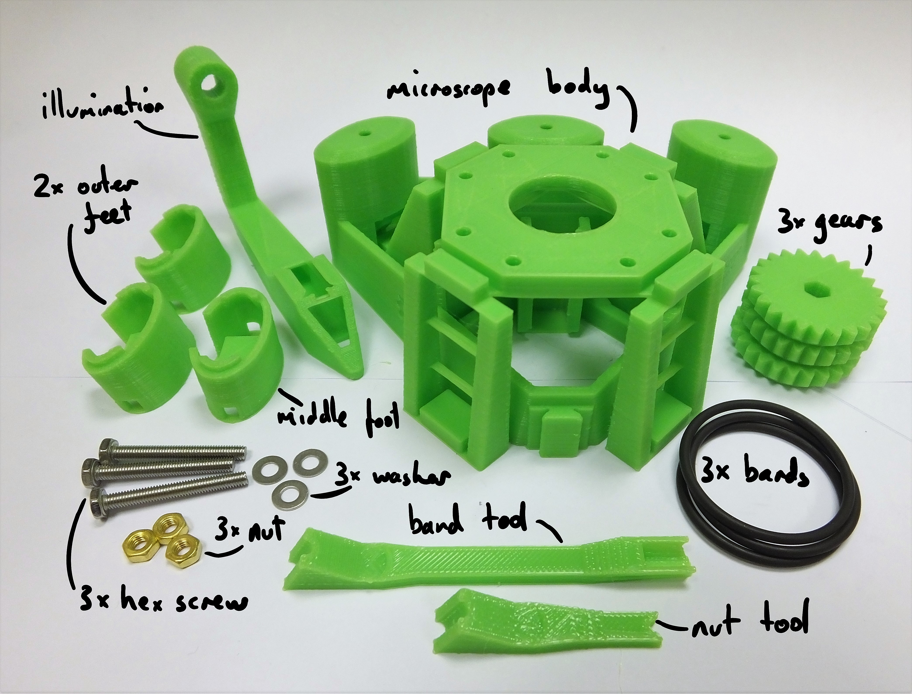
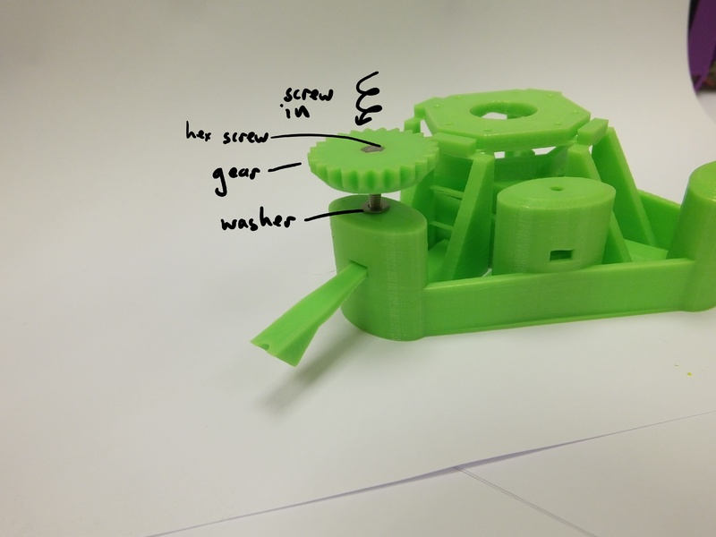
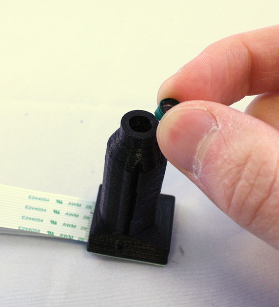
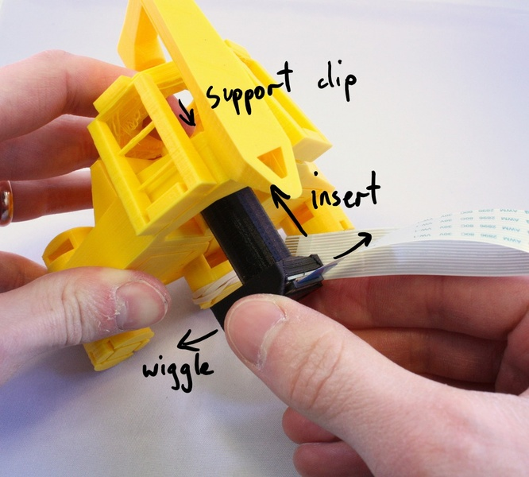
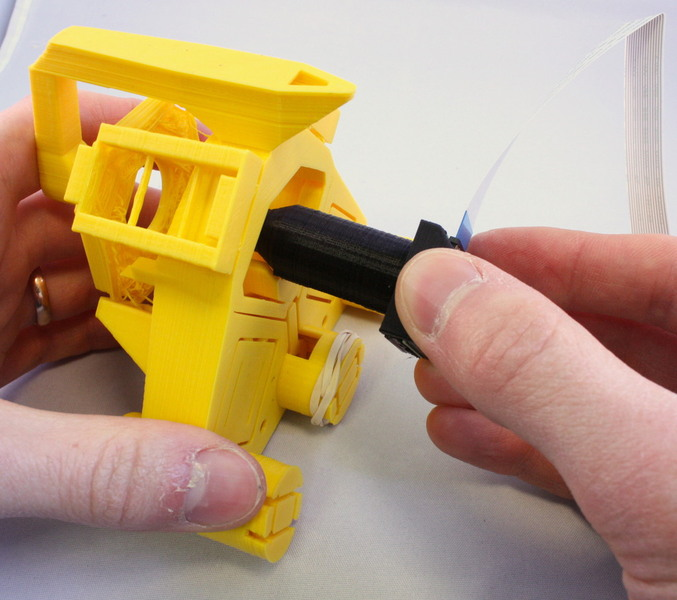
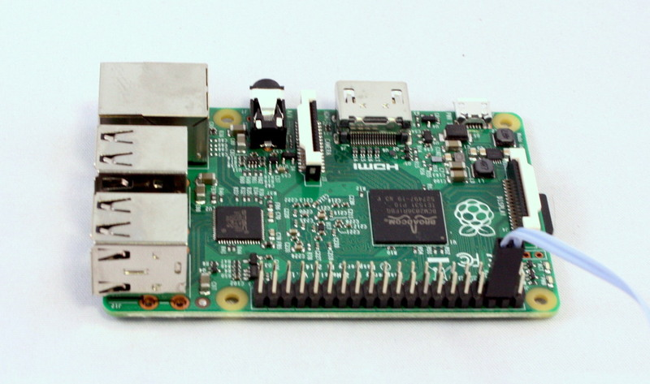
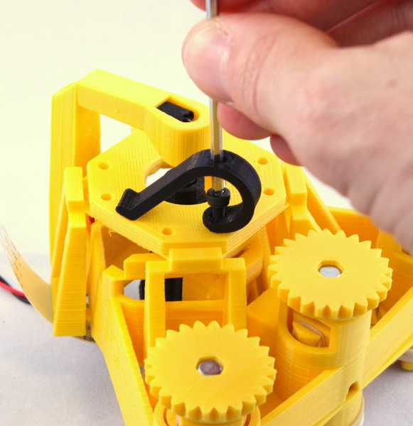
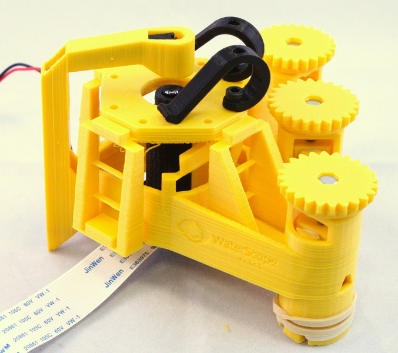

# OpenFlexure Microscope
A 3D-printed microscope, including a flexure-based XYZ stage with sub-micron precision and 8mm range.

The OpenFlexure microscope is a customisable optical microscope, using either very cheap webcam optics or lab quality, RMS threaded microscope objectives.  It uses an inverted geometry, and has a high quality mechanical stage which can be motorised using low cost geared stepper motors.

Optomechanics is a crucial part of any microscope; when working at high magnification, it is absolutely crucial to keep the sample steady and to be able to bring it into focus precisely.  Accurate motion control is extremely difficult using printed mechanical parts, as good linear motion typically requires tight tolerances and a smooth surface finish.  This design for a 3D printed microscope stage uses plastic flexures, meaning its motion is free from friction and vibration.  It achieves steps well below 100nm when driven with miniature stepper motors, and is stable to within a few microns over several days.

This design aims to minimise both the amount of post-print assembly required, and the number of non-printed parts required - partly to make it as easy as possible to print, and partly to maximise stability; most of the microscope (including all the parts with flexures) prints as a single piece.  The majority of the expense is in the Raspberry Pi and its camera module; the design requires only around 200g of plastic and a few nuts, bolts and other parts.  The optics module (containing the camera and lens) can be easily swapped out or modified, for example to change the magnification/resolution by using a microscope objective, or adding a filter cube for fluorescence.

This design is (c) Richard Bowman 2017, released under the CERN open hardware license.

 

# Requirements
## Assemblies
*   1 of Optics module([./basic_optics_module], [./highresolution_optics_module])
*   1 of Illumination([./illumination_arm_fixed], [./adjustable_illumination_arm], [./illumination_arm_with_condenser])
*   3 of [Fine positioning control](./actuator_assembly)

## Parts
*   1 of [Mechanical stage](./parts/microscope_body)
*   2 of [Sample clip attachment screws](./parts/m3x8mm_screws)
*   2 of [Sample clips](./parts/sample_clips)
*   1 of [Control Computer](./parts/raspberry_pi)
*   1 of [Printer test object](./parts/microscope_leg_test_object)

# Assembly Instructions
## Step
First, you will need to print or obtain the 3D printed parts.  If you bought a kit, skip this step! 

 The microscope is designed to print without support material.  This is quite important; if you use support material it will require a lot of cleaning up, and you may well damage the mechanism.  I usually print with a layer size of 0.24mm on my Ormerod, which takes 8 hours for the main structure.  “low” quality on an Ultimaker 2 (0.15mm layers) produced similar results in about 5 hours. 

 If your printer has a standard-sized bed (180mmx180mm should be fine) then it should be possible to print the complete microscope in one go.  I do this if I’m using a machine that is well calibrated and reliable.  However, I find that it’s often more reliable to print in batches (as small parts at the edge of the print bed can detach and cause it to fail).  I would recommend: 
*   Batch 1: Microscope, illumination and Optics module (main part)
*   Batch 2: Feet, gears, camera cover, camera board gripper, camera lens remover, gear riser
 There is a test file that prints a single leg of the microscope - the Microscope leg test object. It's worth printing this first to check your settings are OK.

## Step
Make sure you have all the necessary parts and tools.  The parts should all be listed in the bill of materials, but for clarity you will need: 

 **Plastic parts:** 
*   1x microscope body
*   1x optics module
*   1x illumination and rear foot
*   2x tilted foot
*   1x untilted foot
*   3x gear
*   1x camera cover
*   2x sample clip (optional)
 **Plastic tools (optional but helpful):** 
*   1x camera board gripper (for v1 or v2 of the camera board)
*   1x camera lens remover (for v1 or v2)
*   1x gear elevator (optional)
 **Metal hardware:** 
*   3x M3 hexagon head 25mm screws, stainless steel
*   3x M3 brass nut
*   3x M3 stainless steel washer
*   2x M3 8mm cap head screw (optional, for sample clips)
*   2x M2 6mm cap head screws
 **Electronic parts:** 
*   White LED, resistor, wire, and 2-way JST header connector (assembled as one cable in the kit)
*   Raspbery Pi camera module (v2, though v1 works if you substitute the relevant STL files)
*   Raspberry Pi (with associated power supply, keyboard, monitor, etc.)
 **Tools (not supplied in kit):** 
*   2.5mm hex key (optional, for attaching sample clips)
*   1.5mm hex key (to secure the camera using M2 screws)
*   tape (electrical tape or PTFE plumbers tape work, though regular sticky tape is also fine)
*   sharp craft knife (for trimming tape)
*   3mm drill bit in hand chuck (if you printed the parts yourself and need to open out the holes)
 Don’t forget the raspberry pi, camera module, and associated screen, power supply, SD card, keyboard, mouse, etc. (I have not listed these explicitly, but they're needed to run the Pi). 
### Media
*   

## Step
If you printed the parts yourself, start by opening out the three holes in the microscope body with a drill as shown.  Make sure to go all the way through.  If you don’t have a drill, you can improvise by screwing in an M3 screw all the way, then forcibly rotating it with a screwdriver.  While you’re at it, do the same for the illumination mount.  Also, remove any loose strings of plastic from the underside of the actuator housings or sample stage, using a pair of pliers. The last step shouldn't be necessary if your machine is calibrated nicely for printing bridges.  If you purchased a kit, this may well have been done for you.
### Media
*   

## Step
Depending on which version of the microscope body you have, there may be thin supports linking the mount for the optics module to the frame.  Snap these off with a craft knife, screwdriver, or elastic band tool.
### Media
*   

## Step
First, [assemble the three gears and elastic bands](./actuator_assembly) - it's the same procedure done three times, once for each gear.  You might find the central column is the best one to start with.  NB the instructions for this are in the [actuator assembly brick](./actuator_assembly)
### Media
*   

## Step
Assemble the illumination arm. There are different versions - a [fixed one for a single LED](./illumination_arm_fixed) and [an adjustable one which may have a condenser lens](./illumination_arm_with_condenser).  As with the actuators, the assembly instructions for this are in later sections.
### Media
*   

## Step
Assemble the Raspberry Pi camera into the optics module.  There are two versions of this, a [high-resolution module](./highresolution_optics_module) using an RMS microscope objective, and the [basic optics module](./basic_optics_module) described in later sections.
### Media
*   

## Step
Slot the optics module onto the dovetail mount, from the bottom.  You may find it easier to fit if you wiggle the module from side to side as it goes in.  It may also help to support the dovetail from the top (through the hole in the stage), as it will flex when you push the objective on to it.  If you push too hard it is possible to break the flexure mechanism that holds the optics module.
### Media
*   
*   
*   
*   
*   
*   

## Step

Plug the LED cable into the GPIO connector on the Raspberry Pi, to the 0v and 5v lines.  These are the second and third pins from the top of the connector, on the outside edge - pins number 4 and 6.

 
Plug in the camera to the camera connector as described in the [Raspberry Pi learning materials](https://projects.raspberrypi.org/en/projects/getting-started-with-picamera) (the connector is next to the Ethernet port, and the contacts on the cable face the port, i.e. they face away from the tab on the plug).

 
### Media
*   

## Step
After this, there are only the sample clips to go – exactly where you place these will depend on the samples you intend to use, but in any case you simply push the M3 screws into the clips, then screw down into the holes on the stage.
### Media
*   
*   
*   
*   
*   
*   
*   
*   

## Step
Your microscope is now complete – happy observing!
You might want to consult the [camera module documentation](http://www.raspberrypi.org/documentation/usage/camera/) or [raspicam documentation](http://www.raspberrypi.org/documentation/usage/camera/raspicam/README.md) if you need a hand setting up the camera.
### Media
*   
*   
*   
*   

# Notes
A 3D-printed microscope, including a flexure-based XYZ stage with sub-micron precision and 8mm range.

